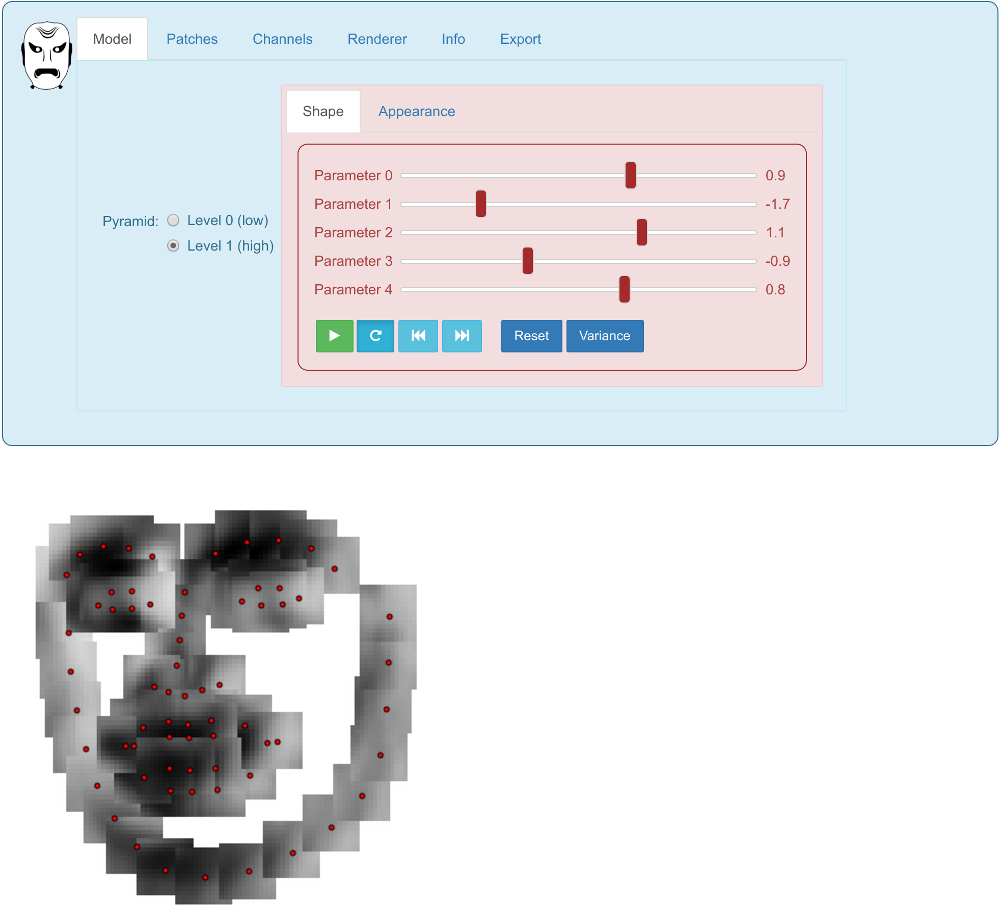
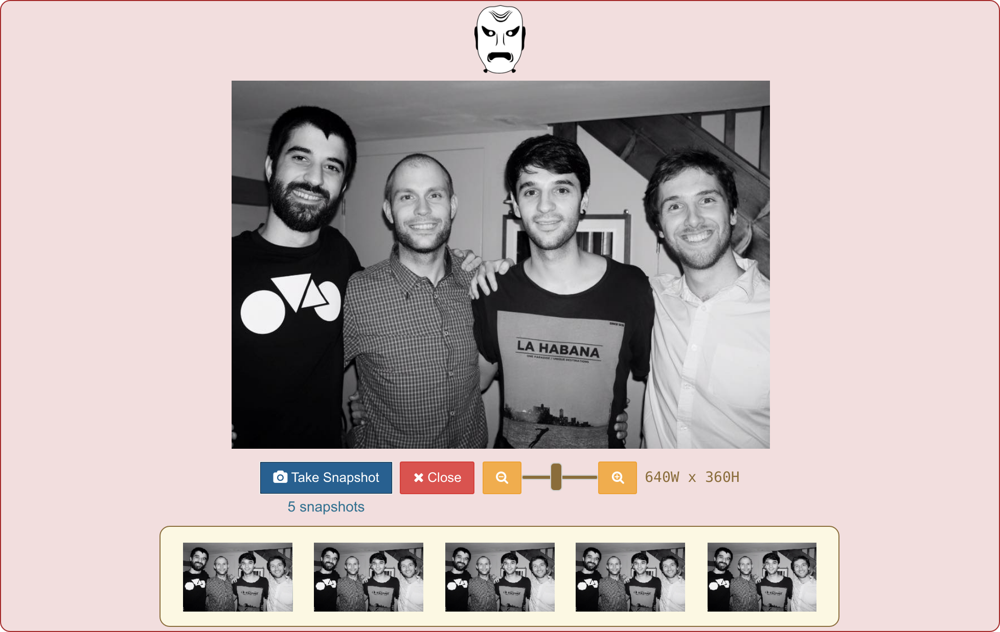

==========================
MenpoWidgets Documentation
==========================

MenpoWidgets is the Menpo Project's Python package for fancy visualization within the Jupyter notebook using interactive widgets.
In the Menpo Project we take an opinionated stance that visualization is a key part of generating research. Therefore, we have tried 
to make the mental overhead of visualizing objects as low as possible. MenpoWidgets makes tasks like data exploration, model observation 
and results demonstration as simple as possible.

.. raw:: html

   

<i class="fa fa-exclamation-circle" aria-hidden="true" style="font-size:4em; padding-right: 15%; padding-bottom: 10%; padding-top: 10%;"></i>
We highly recommend that you render all matplotlib figures <b>inline</b> the Jupyter notebook for the best <em>menpowidgets</em> experience. This can be done by running 
<code>%matplotlib inline</code>
 in a cell. Note that you only have to run it once and not in every rendering cell.

.. raw:: html

   <big><b><a href="http://www.menpo.org/installation/">Installation <i class="fa fa-external-link"></i></a></b></big> 
   Please refer to our detailed <a href="http://www.menpo.org/installation/">installation instructions</a> in <tt><a href="http://www.menpo.org/">menpo.org</a></tt>.
    
    
   <big><b><a href="http://www.menpo.org/menpowidgets/">User Guide <i class="fa fa-external-link"></i></a></b></big> 
   To get started, check out the <a href="http://www.menpo.org/menpowidgets/">user guide</a> in <code><a href="http://www.menpo.org/">menpo.org</a></code> for an explanation of some of the core concepts within MenpoWidgets.
    
    

API Documentation
~~~~~~~~~~~~~~~~~
In MenpoWidgets, we use legible docstrings, and therefore, all documentation 
should be easily accessible in any sensible IDE (or IPython) via tab completion. 
However, this section should make most of the core classes available for viewing online.

Main Widgets  
  Functions for visualizing the various Menpo and MenpoFit objects using interactive widgets.

  .. toctree::
      :maxdepth: 2

      menpowidgets/base/index
      menpowidgets/menpofit/base/index

Options Widgets  
  Independent widget objects that can be used as the main components for designing high-level widget functions.

  .. toctree::
      :maxdepth: 1

      menpowidgets/options/index
      menpowidgets/menpofit/options/index

Tools Widgets
  Low-level widget objects that can be used as the main ingredients for creating more complex widgets.

  .. toctree::
      :maxdepth: 1

      menpowidgets/abstract/index
      menpowidgets/tools/index

Usage Example
~~~~~~~~~~~~~
A short example is often more illustrative than a verbose explanation. Let's assume that you want to quickly explore a folder of numerous annotated images, 
without the overhead of waiting to load them and writing code to view them. The images can be easily loaded using the Menpo package and then visualized using an
interactive widget as:

.. code-block:: python

    %matplotlib inline
    import menpo.io as mio
    from menpowidgets import visualize_images

    images = mio.import_images('/path/to/images/')
    visualize_images(images)

.. image:: visualize_images.png

Similarly, we can load the pre-trained AAM from MenpoFit and visualize it as:

.. code-block:: python

    %matplotlib inline
    from menpofit.aam import load_balanced_frontal_face_fitter

    aam = load_balanced_frontal_face_fitter()
    aam.wrapped_fitter.aam.view_aam_widget()

Finally, MenpoWidgets have a webcam widget that allows you to capture and return multiple snapshots.

.. code-block:: python

    from menpowidgets import webcam_widget
    images = webcam_widget()

